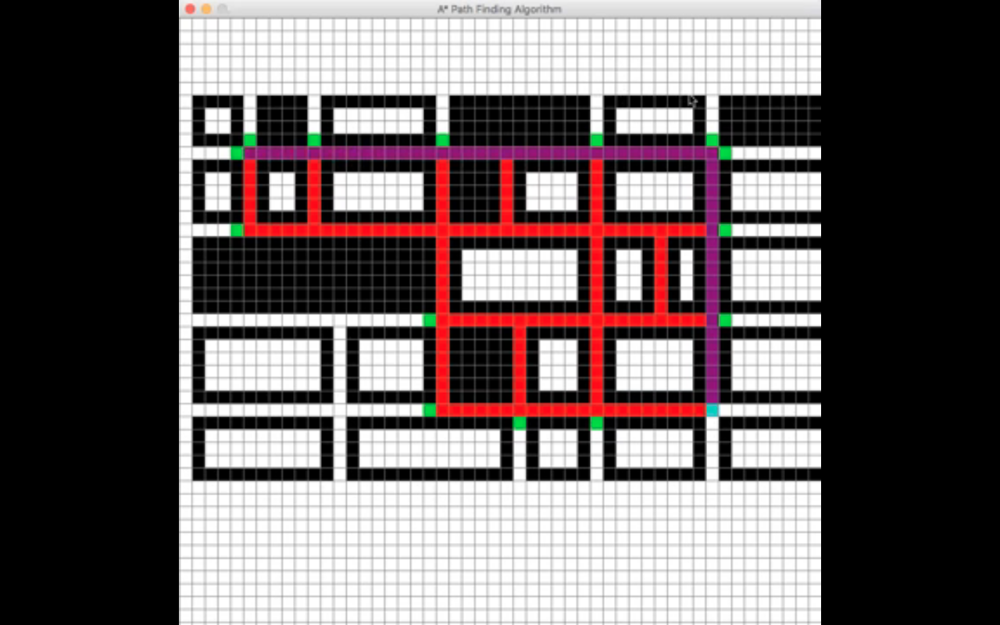

# 
 Path-Finding Visualizer 

 
 

## About this project 📝

This project is a visualization of the A* search algorithm, which finds the 
shortest path between the start and end nodes.
 
 
 
 

## Example 💻

[Video Walk-through](https://drive.google.com/file/d/1-QPjYDwz6KLVGmE1JJPH2QdpCKudKaa8/view?usp=sharing)

## Technologies 💻

 

 
 
 

## Authors

* [Andres Icedo](https://github.com/andresicedo)

 
 

## License

* [MIT](https://opensource.org/licenses/MIT)